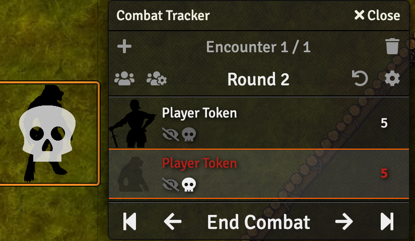
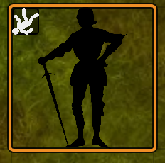
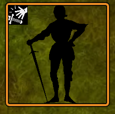
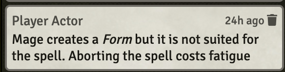

# HârnMaster 3 Automation for Foundry VTT

[)].download_count&url=https://api.github.com/repos/scooper4711/hm3-automation/releases/latest&color=green)](https://github.com/scooper4711/hm3-automation/releases/latest)

With this module installed, there is no need to remember to mark
actors as defeated when they fail their shock rolls. This module
will automatically mark the actor as defeated and put the dreaded
skull icon over its token.

Also, when an actor fails its stumble for fumble roll, an icon is
added to the token in the upper left to remind the player that the
actor's next action needs to be to recover from that mishap.

Lastly, this module will automatically increment a Shek P'var's
fatigue every time he or she casts a spell and doesn't get a
critical success. On critical failures, the player or GM is reminded
of an optional rule of rolling on a critical spell failure table.

This is all done automatically with no need for preferences, settings
or other customization.

For those who have viewed my YouTube channel or looked at the
[HarnMaster example macros page](https://github.com/toastygm/HarnMaster-3-FoundryVTT/wiki/Example-Macros), 
this module implements those macros for you with no need for you
to touch any Javascript or macros.

:stop_sign: Please note: If you have followed my tutorial or otherwise
installed the example macros, you should uninstall them. Otherwise
you risk effects being applied twice and having very tired mages. :D

# Installation

Use FoundryVTT Add-on Module page to install this manifest:
 [https://github.com/scooper4711/hm3-automation/releases/latest/download/module.json](https://github.com/scooper4711/hm3-automation/releases/latest/download/module.json)

# Features
## Shock Failure Automation

If an actor fails a shock roll, it will automatically be
marked as 'defeated' and a Skull icon will appear over its
token.

If there is active combat, then the actor will be highlighted
in red in the combat tracker and should appear as dead there.

The actor also gets an Active Effect of 'Dead' added to its
effects. This Active Effect remains until removed.

## Stumble Failure Automation

If an actor fails a stumble roll, it will automatically be
marked as 'prone' and get an Active Effect of Prone and its
associated icon.

This Active Effect will automatically be disabled *after* the Actor's
next turn. The intent is that the icon serves as a reminder to the 
player that they must spend one round getting back up from prone.

The Active Effect will remain in the Actor's Effects tab. You
may delete it if you want. If the effect isn't there next time
the actor stumbles, a new effect will be created.

## Fumble Failure Automation

If an actor fails a fumble roll, it automatically gains an
active effect of "Fumble". This active effect will 
automatically be disabled *after* the player's next turn. 

The Active Effect will remain in the Actor's Effects tab. You
may delete it if you want. If the effect isn't there next time
the actor fumbles, a new effect will be created.

## Shek P'Var Fatigue Automation

Whenever a spell is cast, depending on the roll result, fatigue will be
added to the actor casting the spell.

|Roll|Result|
|----|------|
|CS|No fatigue |
|MS|+1 fatigue |
|MF|+1 fatigue |
|CF|+1 fatigue |

# Future plans

* house rules for spell fatigue, e.g. low level spells don't cost fatigue
* Fatigue that auto-expires 10 minutes after getting it
